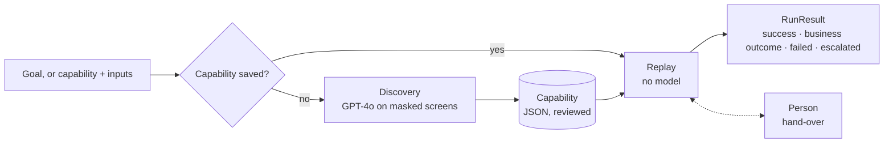

# legacy-ui-agent

A computer-use agent for legacy desktop applications that have no API. It learns a task once
by looking at the screen, saves it as a typed, versioned **capability**, and from then on replays
it without an LLM. When it gets stuck, it hands the live session to a person.

- **Sees the app the way an operator does.** It takes a screenshot, reads it with Windows OCR, and
  uses OpenCV to find controls with a role and a visible label. It needs no DOM, ids or selectors,
  so it works where Playwright can't.
- **Learns once, replays without the model.** GPT-4o drives the first run on masked text only (no
  screenshots, no customer data). The steps are saved as JSON and reviewed. Each replay then
  checks every screen and ends in a typed result.
- **Hands over to a person.** An Agent/Human switch passes the live session to a person and back.
  What the person does is recorded, reviewed, and added to the flow.
- **Learns from outcomes.** A map of the app's windows and moves keeps a reliability score for each.
  Unreliable moves are avoided, and reliability gates approval for unattended use.



The demo target is **BankAPP** (`BankAPP/`), a small core-banking desktop app built with Tkinter and
SQLite, seeded with fake customers.

## Quick start

You need Windows 10 (2004 or later) or 11, Python 3.12, the English OCR language pack (present on
English installs), and an OpenAI API key.

```powershell
git clone https://github.com/Manas110901100/legacy-ui-agent
cd legacy-ui-agent
pip install -r requirements.txt
"OPENAI_API_KEY=sk-..." | Out-File -Encoding ascii .env
```

Start the demo app in a second terminal and log in as `admin` / `admin123`:

```powershell
cd BankAPP ; python -m bankapp
```

The agent never handles credentials; you log in yourself. While it works, leave the mouse and
keyboard alone. Moving the mouse to the top-left corner aborts a run.

## Usage

| Command | What it does |
|---|---|
| `python -m cua --panel` | Operator panel: type a goal and press Automate. Includes the Agent/Human switch |
| `python -m cua "what is the balance of ACC100005"` | Run a goal: discovery the first time, replay afterwards |
| `python -m cua --capability bankapp.account_details --input account=ACC100005 --json` | Production path: typed inputs, no LLM call |
| `python -m cua --list` | Capabilities, their contracts and reliability |
| `python -m cua --approve bankapp.account_details` | Approve for unattended use. Needs 3 clean runs and reliability ≥ 0.7 |
| `python -m cua --map` | Learned windows and moves, with their reliability |
| `python -m cua --learn` | Rebuild reliability records from past runs |
| `python -m cua --explore` | Map the app ahead of time (safe moves only) |

A run returns `success`, `business_outcome` (e.g. `record_not_found`, `ambiguous_match`), `failed`
(code, step, expected, observed, screenshot), `escalated`, `cancelled` or `refused`.

To test error handling, restart BankAPP with one of these environment variables set:

- `$env:BANKAPP_FAULT_RATE="0.6"` makes calls fail transiently; the agent should retry.
- `$env:BANKAPP_SESSION_TIMEOUT="20"` expires the session after 20 s idle; the agent should escalate.

## Safety

- **Allow-list** (`apps/bankapp.json`): three read tasks (find, list, account details) and one write (create account). Edit,
  deposit, transfer, delete and similar actions are refused outright.
- **Customer data never reaches the model.** Every payload is masked into tokens, then leak-checked
  before sending. Logs are masked and screenshots blurred.
- **The one write** needs explicit confirmation, and a failed write is never retried.

## Layout

| Path | Contents |
|---|---|
| `cua/` | The agent: `engine` (discovery, replay, hand-over), `perception` (screen reading), `artifact` (capability schema, results), `safety`, `operator` (panel, recorder), `learning` (map, reliability) |
| `apps/` | App profile: target window, allow-list, known dialogs, task contracts |
| `capabilities/` | Saved capabilities and their JSON Schema |
| `maps/` | Learned map of the app's windows |
| `tests/` | 32 tests on a scripted BankAPP: no app or API key needed |
| `tools/` | Evidence collector, OCR capture helper |
| `evidence/` | Masked runs: discovery, replays, errors, hand-over, learning ([index](evidence/INDEX.md)) |
| `BankAPP/` | The demo target application |

## Tests

```powershell
python -m pytest -q
```

## Documentation

- [REPORT.md](REPORT.md) is the design write-up: architecture, artifact schema, error handling,
  multi-tenant reuse, hand-over, safety and cuts.
- [docs/ARCHITECTURE.md](docs/ARCHITECTURE.md) explains why the agent reads the screen instead of
  the DOM, and has the diagrams and module map.
- [docs/LEARNING.md](docs/LEARNING.md) covers the reinforcement layer and its roadmap.
- [docs/PERCEPTION_STUDY.md](docs/PERCEPTION_STUDY.md) compares the ways of reading a screen.
