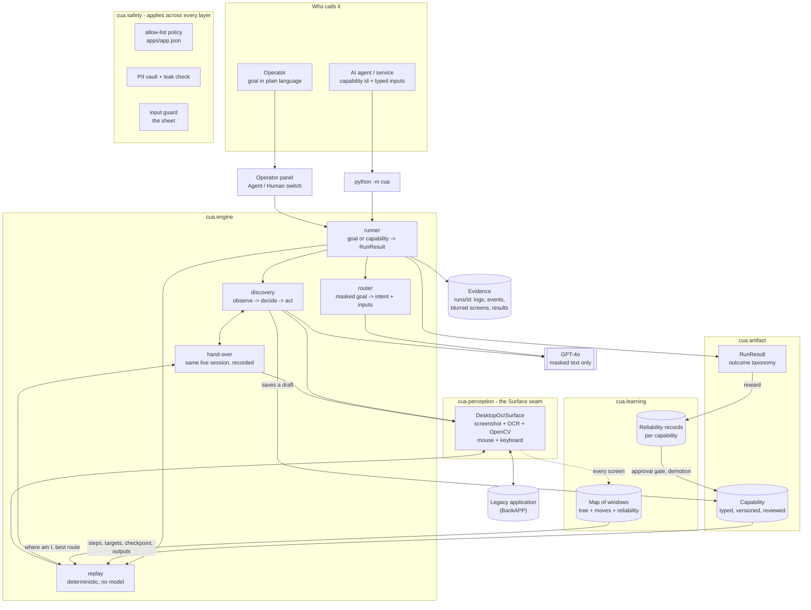
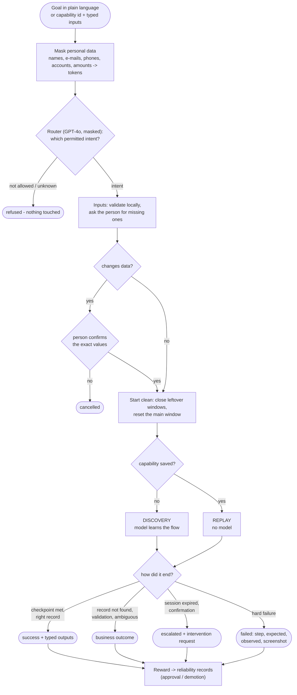
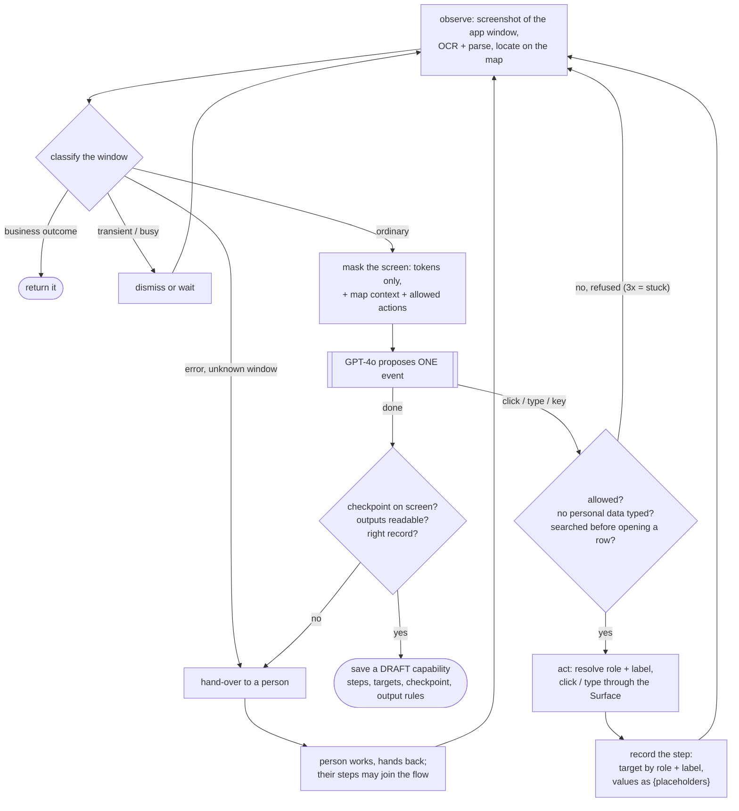
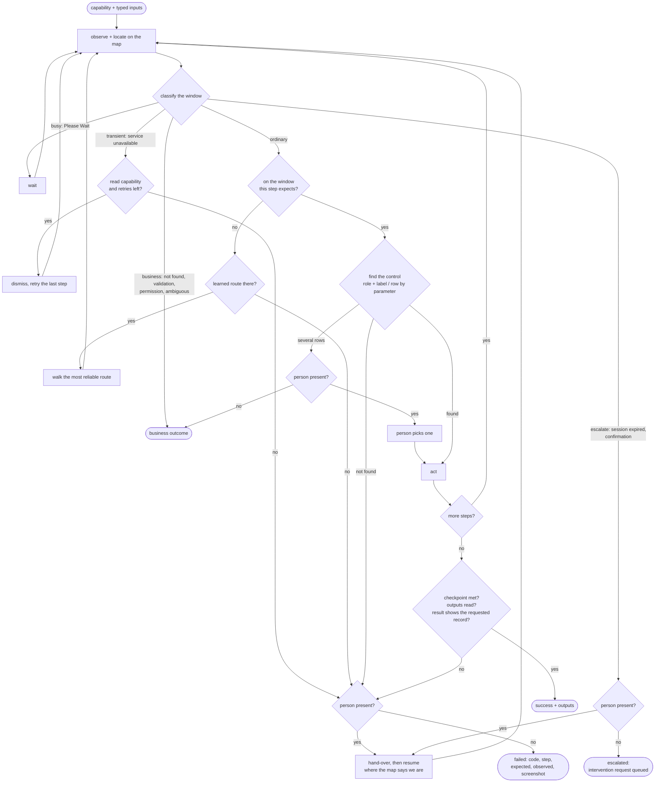
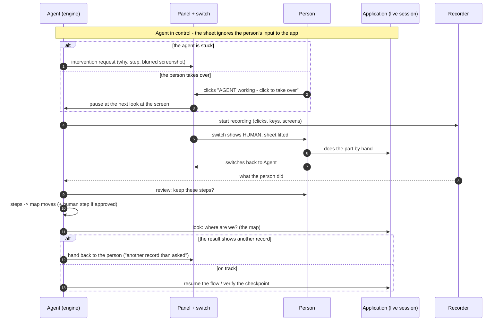
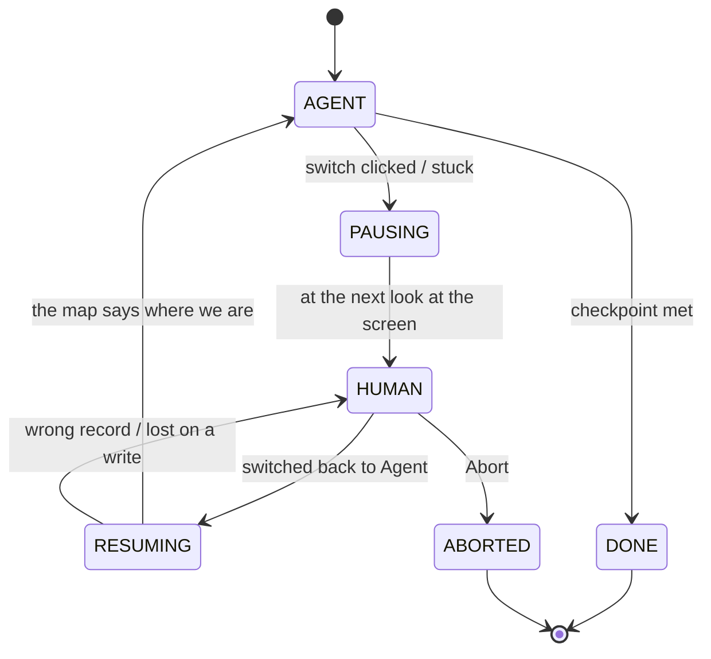
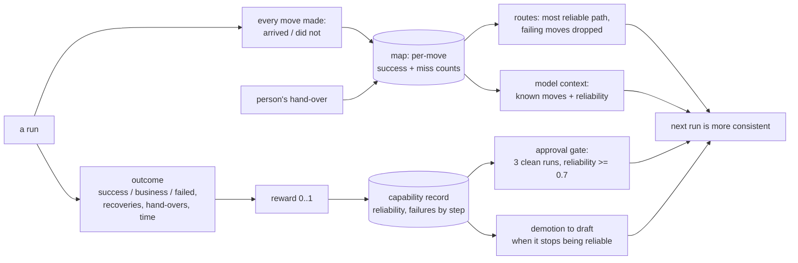

# Architecture

This document explains **why** the system perceives applications the way a person does, **how** the
pieces fit together, and **how** a goal flows through discovery, replay, hand-over and learning.
Diagrams are Mermaid (GitHub renders them). The short version of the design is in
[`REPORT.md`](../REPORT.md); the learning layer is detailed in [`LEARNING.md`](LEARNING.md); the
perception options that were weighed are in [`PERCEPTION_STUDY.md`](PERCEPTION_STUDY.md).

---

## 1. Why vision-first, and not the DOM / Playwright

**I started with Playwright.** It produced output quickly on a clean web page: find the element by
id, click, read. It stopped being the right tool as soon as the target looked like what banks and
credit unions actually run:

* **The ids are not there, or not stable.** Legacy back-office screens have no test ids; where ids
  exist they are generated (`ctl00_ContentPlaceHolder1_GridView1_ctl03_lnk`), change between
  versions and differ between tenants of the same vendor product. A selector strategy has to be
  written, debugged and maintained **per app, per version, per tenant** - across hundreds of
  institutions × ~20 apps that cost is the whole budget.
* **Many surfaces have no DOM at all.** Native desktop apps (Win32, VB6, Delphi, Tk, MFC), terminal
  emulators, Citrix/RDP-published apps: Playwright cannot see them.
* **What stays stable is what the operator sees.** The *Save* button is called *Save* in every
  version; the field next to *Email:* is the e-mail field. Labels, window titles and layout are
  the contract an operator relies on - so the agent relies on them too.

So the system **looks at the screen like a person**:

| | DOM / Playwright | Accessibility (UIA) | **Screen (this system)** |
|---|---|---|---|
| Works without a DOM (desktop, Citrix) | no | often (native controls) | **yes, any app** |
| Needs ids / test ids | yes | no | **no** |
| Per-tenant work when ids differ | rewrite selectors | some | **none (labels)** |
| Exactness of text | exact | exact where exposed | OCR (made robust) |
| Speed per look | fast | fast | ~1.5 s |

How it does that, and what it learns on top:

1. **Perceive like a person** - screenshot (only the app's window, the blinking caret removed),
   Windows OCR, OpenCV to find the controls (bordered boxes, 3D shading, tables, dropdown arrows),
   then every element gets a role and a label: *button "Save"*, *input "Email"*, *table row*.
   Targets are saved as **role + visible label**, never coordinates or ids.
2. **Learn where it is and the path to the next move** - every window the agent sees becomes a node
   of a **map of the app** (a tree: which window opened which), every action that moved between
   windows becomes an edge. Replay locates itself on the map at each step and walks back on track
   by the most reliable learned route.
3. **Learn from people** - when a person takes over, their clicks and typing are recorded, read the
   same way (role + label), shown for approval, and become steps and map moves.
4. **Learn from outcomes (reinforcement)** - every run is scored; every map move and every capability
   keeps a record of how it went; routes, approvals and demotions follow those records
   ([`LEARNING.md`](LEARNING.md)).

The model (GPT-4o) is only used to **discover** a task once, on **masked text** - it never sees a
screenshot or a customer value. After that the task is a **capability** replayed without the model.

---

## 2. System architecture



**Boundaries.** The engine never touches pixels, OCR or the mouse directly - it talks to a
`Surface` that returns `Screen`s (typed elements with role, label, box) and acts on an element.
Capabilities never mention a surface either: they hold windows, roles and labels. That is the seam
that lets the same artifact be replayed through a different surface (UI Automation for native
controls, a DOM / accessibility-tree surface for legacy web) - see REPORT §4.

**Where safety sits.** The allow-list (`apps/bankapp.json`) is checked on every proposal of the
model, on every saved step before replay, on every navigation move and on every step a person
demonstrates. The PII vault masks everything before the model and before anything is written. The
input guard blocks a person's accidental input into the app while the agent works.

---

## 3. From goal to result



An AI agent in production calls `python -m cua --capability <id> --input …` (or the same function):
no router, no model, a typed `RunResult`.

---

## 4. Discovery: the model learns a task once



The flow rules are there because the capability must work **for every record**, not just the one
it was learned on: a row may only be opened after the parameter was searched for (on another
record the row is not on screen), checkpoint text that is not really on screen is dropped, output
labels must be static text (never a value).

---

## 5. Replay: the production path, and what happens when things go wrong



| Condition | Kind | What the agent does | Result |
|---|---|---|---|
| `record_not_found`, `validation_error`, `permission_denied`, `ambiguous_match` | business | stop | `business_outcome` |
| `busy` | recoverable | wait | - |
| `transient` | recoverable | dismiss + retry the step (reads, ≤ 2) | `success` + `recoveries` |
| `session_expired`, `confirmation` | escalate | a person decides | hand-over / `escalated` |
| `target_missing`, `unknown_window`, `checkpoint_failed`, `output_missing`, `result_mismatch`, `app_error`, `timeout`, `not_permitted` | hard | stop | hand-over / `failed` |

---

## 6. Hand-over: the same live session, and back





Who is in control is always visible (the switch) and always recorded (the intervention record's
`in_control`, `opened_at`, `closed_at`, `human_actions`, `decision`).

---

## 7. Learning loop



Details and the roadmap to fuller reinforcement learning: [`LEARNING.md`](LEARNING.md).

---

## 8. Module map

```
cua/
  __main__.py, cli.py     python -m cua ... (goal, --capability, --approve, --list, --map, --learn,
                          --explore, --panel)
  settings.py             model, limits, data paths
  errors.py               Stop / Stuck / Drift / Outcome - how a run ends early, with a code
  engine/
    runner.py             entry points: run_goal, invoke, approve, explore; RunResult; learning hook
    discovery.py          the model learns a task once (observe -> decide -> act)
    replay.py             deterministic replay, recovery, resume after a hand-over
    handoff.py            hand-over of the live session, intervention records, human steps
    navigate.py           moving with the map, start clean, reset, map context for the model
    observe.py            look (locate, classify), find targets, act
    checks.py             checkpoint, outputs, record check, answer text
    llm.py                the only way to the model (masked, leak-checked, logged)
    job.py                Job (one request) and Run (its evidence)
    hooks.py              console / panel interaction, abort and take-over signals
    text.py               small text helpers
  artifact/
    capability.py         the artifact schema (Pydantic -> capabilities/schema.json), storage
    outputs.py            deterministic output extraction (label, pattern, column, rows)
    outcomes.py           condition taxonomy and the RunResult contract
  perception/
    surface.py            the Surface seam; DesktopOcrSurface
    capture.py            DPI-aware window capture (caret removed), window helpers, Windows OCR
    parse_screen.py       OCR + OpenCV -> typed elements (buttons, inputs, tables, ...)
  safety/
    policy.py             allow-list and validators from apps/<app>.json
    pii.py                token vault, masking, leak check, data-free fingerprints
    guard.py              the input "sheet": a person's input to the app ignored while the agent works
  operator/
    panel.py              floating panel, Agent/Human switch, review and pick lists
    recorder.py           records a person's clicks / keys / screens during a hand-over
  learning/
    screenmap.py          map of the app: windows (tree), moves, reliability, routes, consolidation
    rewards.py            how good was a run
    reliability.py        Beta-Bernoulli reliability, capability records, approval gate, demotion
apps/bankapp.json         app profile: target, allow-list, known dialogs, capability contracts
capabilities/             saved capabilities (+ schema.json)
maps/                     learned map per app
runs/                     evidence of every run (not committed; curated copies in /evidence)
tests/                    engine on a scripted app (FakeSurface), units, learning
tools/                    evidence collector, OCR capture helper
```
