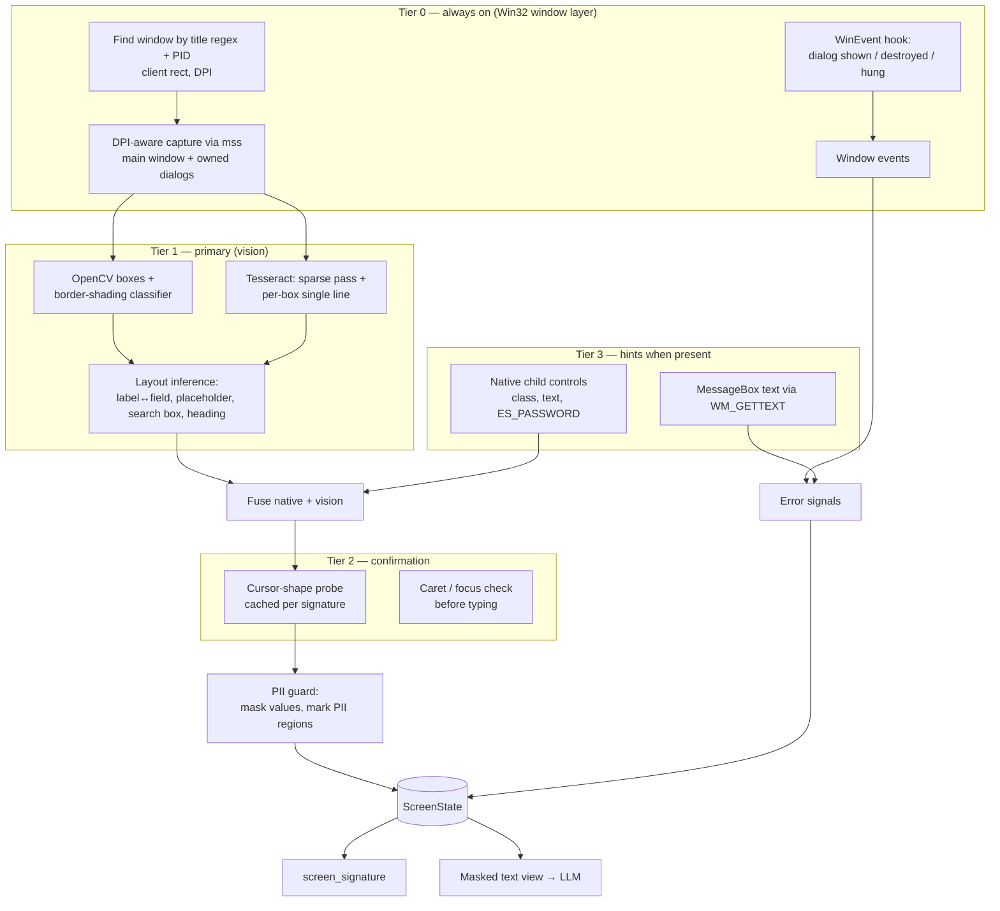

# Phase 1 — Understanding the UI of legacy desktop apps

**Status:** proposal for review · **Date:** 2026-09-24 · **Scope:** perception only. No code yet.

---

## 1. Goal & constraints

**Goal.** Take a legacy Windows app's screenshot plus OS window information and turn it into a `ScreenState`. That is a text-only, PII-masked description of the screen that the LLM can act on, plus the signals the guardrails need.

**Constraints**

- **The LLM never sees the UI.** It gets no screenshots or images, only masked text built from Tesseract OCR (and native control text when it exists).
- **v1 element kinds:** `button`, `input` (with its label or placeholder), `search_box`, and `label` (static text used as anchors and headings). Anything else is `unknown`.
- **Mid-page errors** must be detected and told apart: timeout, invalid credentials, validation, session expired, not found, permission denied, app hung, window lost.
- **Signals for the guardrails:** a `screen_signature` (for the rule that 5 turns on the same page escalates to a human), detection of a lost window or crash, and PII regions (for masking text and blurring saved screenshots).
- **Coordinates are relative to the window only.** No absolute screen coordinates are stored.
- **Targets:** legacy C++ apps (MFC, Win32, VB6, Delphi) and Tk-like apps, with no documentation and no tags or IDs. There is a **backlog of many such apps**, so what each app exposes has to be detected per app, not assumed.
- **Local only.** Nothing leaves the machine except masked text sent to the LLM.

**How claims are marked:** ✅ = standard, documented Windows behaviour · 🔬 = plausible but **to be confirmed in the bake-off (§6)**.

---

## 2. Options catalogue

Each option lists what it gives, how it works on Windows, which toolkits it covers, side effects, PII exposure, cost and a **verdict**.

### A. OS / window-level sources (non-visual)

#### A1. Win32 window layer
- **Gives:** the app's window handle, title, client rect, DPI, process ID, and **every top-level window the process owns**, including dialogs and popups.
- **How:** `EnumWindows` + `GetWindowThreadProcessId` to filter by process ID; `GetClientRect` + `ClientToScreen`; `DwmGetWindowAttribute(DWMWA_EXTENDED_FRAME_BOUNDS)`; `GetDpiForWindow`. At startup our process sets **per-monitor v2 DPI awareness**, so capture pixels and click pixels agree ✅.
- **Coverage:** every toolkit, because every top-level window is an HWND ✅.
- **Side effects:** none. **PII:** titles can contain customer names, so they are masked.
- **Verdict:** **REQUIRED (Tier 0).**

#### A2. Win event hooks
- **Gives:** instant notice of a new dialog or popup, focus changes, and the window being destroyed (crash or lost).
- **How:** an out-of-context `SetWinEventHook` for the app's process ID, subscribed to `EVENT_OBJECT_SHOW`, `EVENT_OBJECT_CREATE`, `EVENT_SYSTEM_DIALOGSTART`, `EVENT_SYSTEM_FOREGROUND` and `EVENT_OBJECT_DESTROY` ✅. It needs a message-loop thread in our process. If the hook misses something, polling `EnumWindows` is the fallback.
- **Verdict:** **REQUIRED (Tier 0).** This is the main trigger for detecting errors in the middle of a page.

#### A3. Native child controls
- **Gives:** exact **type, text, bounding box, enabled/visible state and password flag** for standard controls.
- **How:** `EnumChildWindows`. `GetClassName` returns `Button`, `Edit`, `Static`, `ComboBox` and so on, and `GWL_STYLE` gives `BS_PUSHBUTTON`, `ES_PASSWORD` and `ES_READONLY`. Text comes from `WM_GETTEXT` sent with `SendMessageTimeout`; Windows passes it across processes for standard controls ✅. Position and state come from `GetWindowRect`, `IsWindowVisible` and `IsWindowEnabled`.
- **Coverage:**
  - MFC and raw Win32: high ✅.
  - VB6: controls are windows with class names like `ThunderRT6CommandButton` and `ThunderRT6TextBox` 🔬.
  - Delphi VCL: `TButton`/`TEdit` wrap native controls; `TLabel`/`TSpeedButton` are drawn and have no HWND 🔬.
  - Tk: widgets have HWNDs but expose no useful class or text 🔬.
  - Qt, Java, owner-drawn and skinned UIs: little or nothing.
- **Limits:** placeholder (cue-banner) text is not returned by `WM_GETTEXT`, so vision is still needed for placeholders. Other processes cannot read a password edit's text 🔬.
- **PII:** raw values are read, so they go straight through the PII guard before anything else sees them.
- **Side effects:** none (read-only). `SendMessageTimeout` guards against a hung app.
- **Verdict:** **USE WHEN PRESENT** (app profile `native` or `hybrid`). Never required, because vision must work on its own.

#### A4. UI Automation / MSAA
- **Gives:** Name, ControlType and BoundingRectangle. Windows ships client-side UIA proxies for standard Win32 controls, so apps that never implemented accessibility often still show a basic tree ✅.
- **Cost:** needs COM (`comtypes`), is slower, and can hang on badly behaved providers. For plain Win32 it adds little over A3; it may help with Qt (with its accessibility plugin) or WinForms.
- **Verdict:** **PROBE ONLY** during onboarding (§4.3). Not part of the v1 runtime path.

#### A5. Caret / focus information
- **Gives:** which input has focus and where its caret is. Used to confirm that a click focused the intended field **before typing**, which stops text going into the wrong field.
- **How:** `GetGUIThreadInfo` on the app's UI thread returns `hwndFocus` and `rcCaret`. Standard Edit controls use the system caret ✅; Tk and custom controls may not 🔬.
- **Verdict:** **USE (Tier 2 verification)** when available.

#### A6. Clipboard read-back
- **Gives:** the exact value of an input (Ctrl+A, Ctrl+C) for checking what was typed.
- **Risks:** it overwrites the user's clipboard, which then holds PII (so it must be restored and cleared), and some apps attach handlers to those keys.
- **Verdict:** **OPT-IN** per app profile, off by default.

#### A7. API hooking / DLL injection / memory reading — **REJECTED**
Hooking `DrawText`/`ExtTextOut` would give pixel-exact text, but it is invasive, breaks across app versions, is flagged by AV/EDR and is usually against enterprise policy.

#### A8. Out-of-band data (database, report exports, logs)
Far more reliable than the UI for **read** tasks when it's available. **Out of scope for v1**; noted for the backlog.

### B. Visual (pixel) sources

#### B1. OCR engines

| Engine | Install | Small UI fonts | CPU speed | Notes | Verdict |
|---|---|---|---|---|---|
| **Tesseract 5 (LSTM)** | UB-Mannheim installer + `pytesseract` | Weak raw; good with ×2–3 upscale and binarisation | Medium | Word confidence from `image_to_data`; psm 11 for a sparse whole-window pass, psm 7 for one line per box | **PRIMARY** (your choice) |
| **Windows.Media.Ocr** | Built into Windows 10/11; Python via `winrt` packages | Good 🔬 | Fast 🔬 | Needs OS language packs; may not give confidence scores 🔬 | **FALLBACK candidate** in the bake-off |
| PaddleOCR / RapidOCR (ONNX) | Heavy (paddle) or moderate (onnxruntime) | Strong | Medium | Large dependencies and model downloads | Only if the first two fall short |
| EasyOCR | PyTorch | Good | Slow on CPU | Heavy | Skip |
| Cloud OCR (Azure, Google, …) | — | Strong | Network | **Sends PII off the machine** | **REJECTED** |

**Tesseract preprocessing for legacy UIs:**
- Crop to each element, then upscale ×3 with `INTER_CUBIC`.
- Convert to greyscale (removes ClearType colour fringes), then Otsu or adaptive threshold. Invert on dark backgrounds.
- Add a 10 px white border.
- Use a character whitelist for fields known to be numeric.

#### B2. Classical CV widget detection
- **Boxes:** Canny → dilate → `findContours` → `approxPolyDP` → axis-aligned rectangles. Filter by size (scaled for DPI) and aspect ratio, and drop duplicate nested boxes.
- **3D border shading** (sample 1–2 px strips on each side):
  - Light top/left edges and dark bottom/right edges mean **raised → button**.
  - Dark top/left and light bottom/right mean **sunken → input**.
  - This is characteristic of classic Win32, MFC and Tk ✅.
- **Fill colour:** white means editable input; the control face colour means a button (or a disabled input). Low-contrast text means **disabled**.
- **Coverage:** excellent on the classic look. Weaker on flat, themed styles, where the cursor probe (C1) makes up the difference.
- **Verdict:** **PRIMARY (Tier 1).**

#### B3. Template / feature matching
- `matchTemplate` over several scales for DPI changes, or ORB features. Finds known icons (search magnifier, standard dialog icons) and relocates recorded anchors from recipes.
- **Verdict:** **USE** for icons and as an anchor fallback, not for discovering elements.

#### B4. Layout inference
- **Label ↔ field:** the nearest label to the left on the same row, otherwise the nearest one above within the column width.
- **Placeholder:** grey, mid-luminance text inside an empty input.
- **Search box:** an input whose label or placeholder matches `search|find|lookup|filter`, **or** that sits directly left of a `Search`/`Find`/`Go` button or a magnifier icon.
- **Heading:** the tallest text in the top part of the window.
- **Form rows:** grouped by y-alignment.
- **Verdict:** **PRIMARY (Tier 1).**

#### B5. Trained UI detectors (YOLO / OmniParser-style)
Useful for flat or unusual UIs, but the v1 spec rules out a trained detector. **Deferred to v2**; the bake-off fixtures become its training and eval data.

#### B6. Vision LLMs / set-of-mark prompting — **REJECTED**
They violate the rule that the LLM never sees the UI.

### C. Interaction probes (non-destructive confirmation)

#### C1. Cursor-shape probe
- **How:**
  1. Hover the pointer over the centre of a candidate element (window-relative, converted at execution time).
  2. Call `GetCursorInfo` and compare `hCursor` with `LoadCursor(IDC_IBEAM / IDC_ARROW / IDC_HAND)` ✅.
  3. An I-beam means a **text input**. Tk entries use the `xterm` cursor, which maps to the I-beam 🔬.
- **Side effects:** tooltips and hover highlights. To contain them, move the pointer to a neutral spot and capture again.
- **Cost:** about 50–100 ms per element 🔬. Results are **cached per screen signature** and stored in recipes, so each screen is probed about once.
- **Verdict:** **USE (Tier 2)** on screens only vision can read, when confidence in an element's kind is low.

#### C2. Hover diff
- A colour change on hover means a button. Works for themed/ttk controls, not classic buttons.
- **Verdict:** optional, set per app profile.

#### C3. Tab-focus diff
- Reveals tab order and where inputs are. Leaving a field can trigger that app's **validation-on-exit** logic, so the risk is low but not zero.
- **Verdict:** **onboarding only**; off in AUTO mode.

#### C4. Click or submit probes — **REJECTED**
Clicking has side effects, and guardrails forbid unplanned writes.

### D. Change detection & verification

#### D1. Screen signature
- **Inputs:** only static text — label text, button captions, the heading and the window title, all lowercased with **digits masked**. Input values and PII are excluded.
- **Build:** positions are quantised to a coarse grid (about 1/20 of the window), sorted and hashed with SHA-1.
- **Fuzzy matching:** the token set is kept too, and two signatures match fuzzily when Jaccard similarity is ≥ 0.85.
- **Used by:** the stuck rule, recipe matching and the OCR cache.

#### D2. Frame hashes & diffs
- A dHash of the downscaled frame answers "did anything change?" and keys the OCR cache.
- SSIM and diff regions support `verify` and `wait_for`.
- **Stability** means two consecutive identical frames. This is done by polling with a timeout, never a fixed sleep.

#### D3. Element drift
Change in bounding box plus the pHash distance between crops (DCT-based pHash in OpenCV). Flags recipe anchors that are drifting.

---

## 3. Comparison matrix

● good · ◐ partial · ○ poor/none. Coverage columns: **W** = Win32/MFC, **V** = VB6/Delphi, **T** = Tk, **O** = owner-drawn/skinned.

| Option | Accuracy | Deterministic | No side effects | Low PII exposure | Speed | Easy install | W | V | T | O | Verdict |
|---|---|---|---|---|---|---|---|---|---|---|---|
| A1 Win32 window layer | ● | ● | ● | ◐ | ● | ● | ● | ● | ● | ● | **Required** |
| A2 WinEvent hooks | ● | ● | ● | ● | ● | ● | ● | ● | ● | ● | **Required** |
| A3 Native child controls | ● | ● | ● | ◐ | ● | ● | ● | ◐ | ○ | ○ | **Use when present** |
| A4 UIA / MSAA | ◐ | ◐ | ● | ◐ | ◐ | ◐ | ● | ◐ | ○ | ○ | Probe only |
| A5 Caret / focus | ● | ● | ● | ● | ● | ● | ● | ◐ | ◐ | ○ | Use (verify) |
| A6 Clipboard read-back | ● | ◐ | ○ | ○ | ◐ | ● | ● | ● | ● | ◐ | Opt-in |
| A7 Hooking / injection | ● | ◐ | ○ | ○ | ● | ○ | ● | ● | ● | ● | Rejected |
| B1 Tesseract | ◐ | ● | ● | ● | ◐ | ◐ | ● | ● | ● | ● | **Primary OCR** |
| B1 Windows OCR | ◐ 🔬 | ● | ● | ● | ● | ● | ● | ● | ● | ● | Fallback candidate |
| B1 Cloud OCR | ● | ● | ● | ○ | ◐ | ● | ● | ● | ● | ● | Rejected |
| B2 Classical CV | ◐ | ● | ● | ● | ● | ● | ● | ● | ● | ◐ | **Primary** |
| B3 Template matching | ◐ | ● | ● | ● | ● | ● | ● | ● | ● | ● | Icons / anchors |
| B4 Layout inference | ◐ | ● | ● | ● | ● | ● | ● | ● | ● | ◐ | **Primary** |
| B5 Trained detector | ● | ● | ● | ● | ◐ | ○ | ● | ● | ● | ● | v2 |
| B6 Vision LLM | ● | ○ | ● | ○ | ○ | ● | ● | ● | ● | ● | Rejected |
| C1 Cursor probe | ● | ● | ◐ | ● | ◐ | ● | ● | ● | ● 🔬 | ◐ | Use (confirm) |
| C2 Hover diff | ◐ | ◐ | ◐ | ● | ◐ | ● | ○ | ◐ | ◐ | ◐ | Optional |
| C3 Tab-focus diff | ● | ◐ | ◐ | ● | ◐ | ● | ● | ● | ● | ◐ | Onboarding only |

---

## 4. Recommended pipeline

### 4.1 Layers



**Fusion rules**
1. If a native control overlaps a vision box (IoU ≥ 0.5), the element takes the **native** kind, text and bounding box, and the vision crop (`source="fused"`).
2. Vision-only elements are kept with `source="vision"` and a confidence score. Low-confidence kinds go to the cursor probe (C1).
3. An input's value comes from native `WM_GETTEXT` when available, otherwise from OCR. It **always passes through the PII guard before it is stored**; the `ScreenState` holds only the masked value and a token.
4. A field flagged as a password (native `ES_PASSWORD`, or a label matching `password|pin|secret`) is **never read**.
5. If Tesseract's mean confidence on an element is below the threshold, that crop is re-read with the fallback engine, if one is enabled.

### 4.2 The `ScreenState` contract

```python
class Element(BaseModel):
    id: int
    kind: Literal["button", "input", "search_box", "label", "unknown"]
    text: str | None            # button caption / label text
    label: str | None           # inputs: associated label
    placeholder: str | None     # inputs: grey hint text
    value_masked: str | None    # inputs: PII-masked current value
    is_password: bool = False
    enabled: bool = True
    bbox: tuple[int, int, int, int]  # window-relative x, y, w, h
    source: Literal["native", "vision", "fused"]
    confidence: float

class Dialog(BaseModel):
    title_masked: str
    text_masked: str
    icon: Literal["error", "warning", "info", "question", "none"]
    buttons: list[str]

class ScreenState(BaseModel):
    window_title_masked: str
    heading: str | None
    signature: str               # SHA-1 of normalised static text layout
    signature_tokens: frozenset[str]
    elements: list[Element]
    dialogs: list[Dialog]
    pii_regions: list[tuple[int, int, int, int]]  # for screenshot blurring
    app_hung: bool               # IsHungAppWindow
    frame_hash: str
```

Crops and screenshots stay on disk under `runs/<run_id>/`, with PII regions blurred. **They are never sent to the LLM.**

**What the LLM actually receives** (example):

```
Window: "Core Banking – Open Account"      Heading: "Open New Account"
Dialogs: none
Elements:
 [1] label      "Customer Details"
 [2] input      label="First Name"   value=""
 [3] input      label="SSN"          value=<SSN_1>
 [4] input      label="Password"     (password – value hidden)
 [5] search_box placeholder="Search branch..."
 [6] button     "Next"
 [7] button     "Open Account"       (irreversible → request_commit only)
```

### 4.3 Per-app onboarding probe (scales across the backlog)

`ui-agent probe --title "<regex>"` runs once for each new app (and again after upgrades). It records:
- the native-control count and **coverage** (share of detected boxes that have a native match);
- the number of UIA elements;
- Tesseract's mean confidence and the fallback engine's confidence;
- the cursor-probe agreement rate;
- the error-dialog classes seen.

It writes a profile that the runtime reads:

```yaml
# config/apps/<app>.yaml
app: core_banking
window_title_regex: "^Core Banking"
process_name: corebank.exe
launch: "C:\\Apps\\CoreBanking\\corebank.exe"
profile: hybrid              # native | hybrid | vision  (set by `ui-agent probe`)
dpi_awareness: per_monitor_v2
native:
  enabled: true
  class_map: { Button: button, Edit: input, Static: label }
vision:
  ocr_engine: tesseract
  ocr_fallback: windows      # or: none
  upscale: 3
  theme: classic             # classic | flat
probes:
  cursor_probe: true
  hover_diff: false
  clipboard_readback: false
error_dialog_classes: ["#32770"]
probe_report:
  native_coverage: 0.82
  uia_elements: 41
  ocr_mean_conf: 88
  probed_at: 2026-09-24
```

**Profile rules:**
- `native` means coverage ≥ 0.8.
- `hybrid` means coverage from 0.2 up to 0.8.
- `vision` means coverage < 0.2.

These are starting thresholds, to be tuned in the bake-off.

---

## 5. Error detection from perception

Perception only **produces signals** (with masked text). Classification and policy (retry, escalate, never retry) belong to the Phase 2 guardrails.

| Signal | Source | Tier | Reliability |
|---|---|---|---|
| New top-level window owned by the app | WinEvent hook / `EnumWindows` | 0 | High ✅ |
| Dialog text | `WM_GETTEXT` on the `Static` child of a `#32770` dialog; otherwise OCR of the dialog crop | 3 / 1 | Exact when native, else medium |
| Dialog icon (error / warning / info) | Template match against the standard system icons | 1 | Medium 🔬 |
| Inline error text (red text near a field, status bar) | OCR + red-hue mask | 1 | Medium |
| App hung (UI thread not responding) | `IsHungAppWindow`, "(Not Responding)" title | 0 | High ✅ |
| Window destroyed / process exited | WinEvent destroy / process check | 0 | High ✅ |
| Crash dialog ("… has stopped working") | New `WerFault.exe` window | 0 | High ✅ |

| Error class | Typical text / signal | Main perception source |
|---|---|---|
| `INVALID_CREDENTIALS` | "invalid username or password", "login failed" | Dialog text / inline text |
| `ACCOUNT_LOCKED`, `PERMISSION_DENIED` | "account locked", "access denied" | Dialog text |
| `TIMEOUT`, `CONNECTION` | "timed out", "server unavailable" | Dialog text |
| `APP_HUNG` | UI thread not responding | `IsHungAppWindow`; kept separate from TIMEOUT, which the app reports itself |
| `SESSION_EXPIRED` | "session expired, please log in again" | Dialog text / screen signature back at login |
| `VALIDATION` | "required", "invalid format", red text by a field | Inline text + field association |
| `NOT_FOUND` | "no records found" | Inline or dialog text (a valid result for read tasks) |
| `UNKNOWN_ERROR` | Error icon or error-like dialog that matches no class | Dialog + icon |
| `WINDOW_LOST`, `CRASH` | Window gone, WER dialog | Tier 0 events |

---

## 6. Evaluation plan (bake-off)

**Targets**
- **Tk demo app** (`demo_app/`), which exercises the vision path:
  - screens: login, customer search, customer detail, open-account form, confirm dialog;
  - flags to inject errors: `--fail=timeout|invalid_creds|validation|session_expired`.
- **Native Windows apps**, which exercise the native and hybrid paths: `charmap.exe`, `odbcad32.exe`, and a native `MessageBoxW` raised through ctypes.
- **Your real app's** screenshots and probe runs, when available.

**Ground truth:** `tests/fixtures/<name>.png` plus `<name>.expected.json` (kind, bbox, text, label, placeholder).

**Configurations compared**
- Tesseract psm {6, 11} × upscale {×2, ×3} × threshold {Otsu, adaptive}
- Windows OCR
- RapidOCR, only if the first two miss the targets
- On native apps: native-only vs vision-only vs fused

**Metrics and proposed acceptance targets**

| Metric | Target |
|---|---|
| Detection recall (button / input / search box, IoU ≥ 0.7) | ≥ 95 % |
| Detection precision | ≥ 90 % |
| Kind accuracy | ≥ 95 % |
| Label-association accuracy | ≥ 95 % |
| Word accuracy on captions & labels | ≥ 97 % |
| Signature stability (same screen, different data → same signature; different screens → different) | 100 % on fixtures |
| Error-dialog detection latency | < 500 ms from appearance |
| Full parse time (CPU) | < 1.5 s per frame |
| Re-check on a cached screen | < 200 ms |

**Output:** `bakeoff_report.md` with the numbers. The winning defaults are written into the app profiles.

---

## 7. Open questions

1. **Can we run probes against your real app** (hover, read window text), or only work from screenshots?
2. What does it look like: **classic 3D controls or flat/themed**? Display **DPI scaling**? **UI language(s)**?
3. Are its error popups **standard Windows message boxes** or custom-drawn windows?
4. Is **hovering the pointer** acceptable during AUTO mode (for the cursor probe)?
5. May we **use native Win32 text when it's present** (recommended), given that the original spec said not to depend on pywinauto controls? Vision still has to work on its own.
6. May I install **Tesseract** (`winget install UB-Mannheim.TesseractOCR`), and may **Windows OCR** be used as a fallback?
7. Which **PII categories** matter in your domain beyond SSN, card, account number, phone, email and date of birth?

---

## 8. Exit criteria & next step

Phase 1 planning is done when this document is approved and §7 is answered. The next step is **Phase 1 implementation**, which will:
- scaffold the project (uv, config, pydantic models);
- build the Tier 0 window and event layer, the Tier 1 vision parser, the Tier 3 native hints and the Tier 2 cursor probe;
- add the `ui-agent probe` and `ui-agent perceive` commands;
- add the demo app, fixtures, bake-off script and offline pytest suite.

Then it stops for your review.
